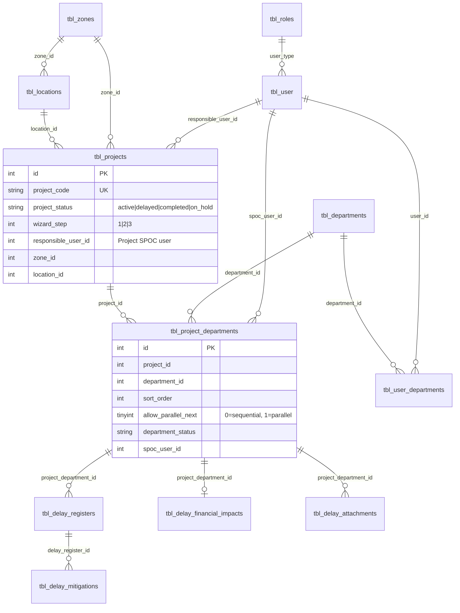

# PDTS — Project Guide (Flows, Decisions, Schema & Reusable Components)

This document captures **what was built**, **why key decisions were made**, **validations**, **database relationships**, and **reusable components** for the Project Delay Tracking System (PDTS). Use it when extending or modifying the project wizard, SPOC workflows, grids, or permissions.

Related docs: [DATABASE_SCHEMA.md](DATABASE_SCHEMA.md) (FRS modules 1–4), [CODING_STANDARDS.md](CODING_STANDARDS.md), [IMPLEMENTATION_PLAN.md](IMPLEMENTATION_PLAN.md).

---

## 1. System overview

PDTS is a Laravel 8 admin application for hospital renovation / project delay tracking:

- **Admins / Managers** — full project CRUD via wizard, master data (departments, locations, zones, users, roles).
- **SPOC users** (single role: **Department SPOC**) — access scoped by **data assignment**, not by separate role types.
- **Project wizard** — 3-step flow: General → Departments → Execution.
- **Department execution** — sequential or parallel workflow, delay/financial/attachment panels per department row.
- **Grids** — reusable DataTables shell with Actions-first layout, filters, export.

**Important:** There are **no database foreign keys**. All relationships are integer reference columns + application-layer joins. Always filter `is_delete = 0`.

---

## 2. Work completed (summary)

| Area | What was done |
|------|----------------|
| **Locations CRUD** | `tbl_locations` linked to zones; zone → location cascade in wizard |
| **Dashboard** | Zone metrics, zone filter, scoped analytics via `UserScopeService` |
| **Project wizard** | 3-step wizard replacing sidelayout project form for main workflow |
| **Department execution** | Accordion UI, status workflow, delay/financial/attachment side panels |
| **SPOC tasks** | My Department Tasks grid + sidelayout task detail |
| **User scoping** | My Projects vs My Department Tasks vs full Projects list |
| **Grid UX** | Actions column first, autofit width, header/body alignment fix |
| **Wizard UX** | Stay on Execution step after Save/In Progress/Complete; reload without manual refresh |
| **Parallel departments** | `allow_parallel_next` flag per department in sortable list |
| **Permissions** | Project SPOC wizard saves via `my_projects` + assignment; single SPOC role |
| **Completed lock** | `project_status = completed` → read-only everywhere, no API saves |
| **Migrations** | `allow_parallel_next`, SPOC role consolidation |

---

## 3. Permission model

### 3.1 Module permissions (`tbl_roles.permission_types`)

| Permission | Who typically has it | Purpose |
|------------|---------------------|---------|
| `projects` | Super Admin, Admin, Manager | Full **Projects** list, create projects, wizard admin access |
| `my_projects` | Department SPOC | **My Projects** menu — projects where user is project owner |
| `spoc_tasks` | Department SPOC | **My Department Tasks** menu |
| `departments`, `locations`, `users`, `roles` | Admins | Master data CRUD |
| `dashboard_view` + widget keys | Most roles | Dashboard visibility |

Legacy aliases are supported via `RoleManagement::getModulePermissionAliases()` (e.g. `spoc_project_access` → `my_projects`).

### 3.2 Single SPOC role decision

**Decision:** Only one application role is used for SPOCs: **`Department SPOC`**.

Both “Project SPOC” and “Department SPOC” in the UI refer to **assignments**, not separate roles:

| UI label | Assignment field | Effect |
|----------|------------------|--------|
| **Project SPOC** (General step) | `tbl_projects.responsible_user_id` | User appears in **My Projects**; can edit full wizard for that project |
| **Department SPOC** (Execution step) | `tbl_project_departments.spoc_user_id` | User sees that department row in **My Department Tasks** |
| **User profile departments** | `tbl_user_departments.department_id` | User can claim unassigned dept rows in their department pool |

The duplicate **Project SPOC** role was removed; existing users were merged via migration `2026_06_12_100200_consolidate_spoc_roles`.

### 3.3 Access scoping (`UserScopeService`)

| Method | Used for |
|--------|----------|
| `hasFullProjectsPermission()` | Full admin project access (`projects` permission) |
| `hasMyProjectsAccess()` | `my_projects` (or legacy SPOC keys) |
| `hasMyDepartmentTasksAccess()` | `spoc_tasks` |
| `shouldUseMyProjectsListing()` | Route user to My Projects instead of Projects |
| `applyMyProjectsScope()` | **Only** `responsible_user_id = current user` |
| `applyProjectScope()` | Broader scope: responsible OR dept pool OR `spoc_user_id` on any dept |
| `applyProjectDepartmentScope()` | Rows for My Department Tasks |
| `canEditProject($projectId)` | Edit wizard — false if completed or not owner (unless admin) |
| `canAccessProject($projectId)` | View access (includes read-only completed) |
| `canAccessProjectDepartment($pdId)` | Single department task access |
| `isProjectCompleted($projectId)` | Lock check — `project_status = completed` |

**Key decision:** My Projects must **not** list projects where the user is only a department SPOC. That work belongs in My Department Tasks.

---

## 4. Application flows

### 4.1 Project wizard (3 steps)

```
┌─────────────┐     save_wizard_step1      ┌──────────────┐     save_wizard_departments     ┌───────────────┐
│  Step 1     │ ─────────────────────────► │   Step 2     │ ─────────────────────────────► │   Step 3      │
│  General    │      wizard_step = 2       │ Departments  │       wizard_step = 3          │  Execution    │
└─────────────┘                            └──────────────┘                                └───────────────┘
```

| Step | Form ID | POST endpoint | Sets |
|------|---------|---------------|------|
| 1 — General | `masterForm0` | `save_wizard_step1` | Project master fields, `responsible_user_id`, `wizard_step ≥ 2` |
| 2 — Departments | `masterForm1` | `save_wizard_departments` | Ordered dept IDs, parallel flags, `wizard_step = 3` |
| 3 — Execution | `masterForm2` | `save_wizard_finish` | Marks wizard complete (optional); mainly navigation |

**Wizard step persistence:** `tbl_projects.wizard_step` (1=General, 2=Departments, 3=Execution).

**Tab gating:**

- Step 2 enabled when `wizard_step >= 2`
- Step 3 enabled when `wizard_step >= 3`
- Query `?step=execution` forces Execution tab on load (used after department actions reload)

**Who can create:** Only users with full `projects` permission (`denyWizardManageUnless` on create).

**Who can edit:** Full `projects` OR (`my_projects` + `responsible_user_id` on that project).

**Completed projects:** Wizard opens **read-only** (banner, disabled fields). All save endpoints return error.

### 4.2 Department selection & order (Step 2)

1. User checks departments from master list (`tbl_departments`).
2. Selected items appear in `#deptSortable` (jQuery UI sortable).
3. Each row (except last) may set **Allow next step parallely** → `allow_parallel_next` on `tbl_project_departments`.
4. Hidden fields posted: `department_order` (comma IDs), `department_parallel` (JSON `{dept_id: 0|1}`).

`ProjectDepartmentService::syncProjectDepartments()` upserts rows, soft-deletes removed departments, then `recomputeDepartmentAvailability()`.

### 4.3 Department execution workflow (Step 3)

Each project department row (`tbl_project_departments`) has status:

| Status | Meaning |
|--------|---------|
| `pending` | Not yet unlocked (accordion disabled) |
| `start` | Ready to work |
| `in_progress` | Work started |
| `delay` | Marked delayed |
| `completed` | Department finished |

**Sequential (default):** Department *N+1* stays `pending` until department *N* is `completed`.

**Parallel:** If department *N* has `allow_parallel_next = 1`, department *N+1* can become `start` while *N* is still in progress.

Core logic lives in:

- `ProjectDepartmentService::recomputeDepartmentAvailability()` — unlock rules on save/order change
- `ProjectDepartmentService::canEditDepartment()` — blocks actions on locked rows
- `ProjectDepartmentService::isDepartmentLocked()` — UI accordion/panel gating
- `ProjectDepartmentService::markCompleted()` — completes row, recomputes next, rolls up project status

**Department actions (AJAX):**

| Action | Endpoint | Notes |
|--------|----------|-------|
| Save meta (dates, SPOC, remarks) | `save_project_department` | Shared by wizard + My Department Tasks |
| In Progress / Complete | `update_department_status` | `action=in_progress\|complete` |
| Delay register | `wizard_save_delay`, `wizard_save_mitigation` | Side panel |
| Financial impact | `wizard_save_financial` | Side panel |
| Attachments | `wizard_save_attachment` | Side panel |

**After Save / In Progress / Complete:** `reloadWizardExecutionStep()` reloads with `?step=execution` so user stays on Execution tab.

### 4.4 Project status rollup

When **all** department rows are `completed`:

- `tbl_projects.project_status` → `completed`
- Project becomes **locked** (no edits)

Other rollup rules in `syncProjectRollupStatus()`:

- Any dept `delay` → project `delayed`
- Depts in `start` / `in_progress` → project `active`

### 4.5 My Projects flow

```
User with my_projects (no full projects)
        │
        ▼
get_my_project_list → applyMyProjectsScope()
        │
        ▼
Only rows where tbl_projects.responsible_user_id = auth user
        │
        ▼
Edit icon → wizard (if canEditProject)
View icon → wizard read-only (if completed)
```

### 4.6 My Department Tasks flow

```
User with spoc_tasks
        │
        ▼
get_spoc_task_list → applyProjectDepartmentScope()
        │
        ▼
Rows where:
  • User is project responsible (all depts on owned projects), OR
  • spoc_user_id = user, OR
  • department_id in tbl_user_departments AND spoc_user_id IS NULL (pool / unclaimed)
        │
        ▼
Manage Task sidelayout → task-detail.blade.php
  → shared dept-workflow-fields partial + bindDepartmentWorkflowHandlers()
```

**Auto-claim:** When a scoped user opens a task with no `spoc_user_id`, `SpocTasksController::claimTaskIfUnassigned()` may assign them.

### 4.7 SPOC user creation (in wizard)

Endpoint: `wizard_create_spoc_user`

- Creates `tbl_user` with role **Department SPOC** (auto-provisioned if missing).
- **Project context** (`spoc_role=project`): user selectable as Project SPOC only — no dept assignment.
- **Department context** (`spoc_role=department`): also sets `spoc_user_id` on `tbl_project_departments` and syncs `tbl_user_departments`.

---

## 5. Validations

### 5.1 Project (wizard step 1)

| Rule | Location |
|------|----------|
| `project_code` required | `ProjectWizardController::validateProjectData()` |
| `project_name` required | same |
| `project_code` unique (excluding self on update) | same |
| Permission: create requires `projects` | `denyWizardManageUnless()` |
| Permission: update requires manage access | same |
| Completed project cannot update | `denyIfProjectCompleted()` |

### 5.2 Departments (wizard step 2)

| Rule | Location |
|------|----------|
| At least one department selected | `save_wizard_departments` |
| Valid `project_id` | same |
| Parallel flag only stored for non-last items | `syncProjectDepartments()` |

### 5.3 SPOC user creation

| Rule | Location |
|------|----------|
| first_name, last_name, email, mobile, password required | `validateSpocUserData()` |
| Valid email format | same |
| Unique email & mobile | same |
| Password strength (8+ chars, upper, lower, number, special) | same |

### 5.4 Department workflow

| Rule | Location |
|------|----------|
| Previous dept must complete (unless parallel flag) | `canEditDepartment()` |
| Cannot complete if blocked by sequence | `markCompleted()` |
| Completed project blocks all dept saves | `denyIfProjectCompleted()` |
| Department access assert | `assertDepartmentAccess()` |

### 5.5 Delay / financial / attachments

| Rule | Location |
|------|----------|
| Delay title required | `wizard_save_delay` |
| Attachment type required | `wizard_save_attachment` |
| Access + completed checks | each save handler |

---

## 6. Database tables & relationships

### 6.1 Core entity diagram (wizard / SPOC scope)



### 6.2 Table reference (wizard-focused)

| Table | Purpose | Key columns |
|-------|---------|-------------|
| `tbl_projects` | Project master | `project_code`, `project_status`, `wizard_step`, `responsible_user_id`, `zone_id`, `location_id` |
| `tbl_project_departments` | Dept rows per project | `project_id`, `department_id`, `sort_order`, `allow_parallel_next`, `department_status`, `spoc_user_id` |
| `tbl_departments` | Master departments (was delay categories) | `department_name`, `description` |
| `tbl_zones` | Geographic zones | `zone_name` |
| `tbl_locations` | Locations within zone | `zone_id`, `location_name` |
| `tbl_user` | Users | `user_type` → `tbl_roles.id` |
| `tbl_user_departments` | User ↔ dept pool | `user_id`, `department_id` |
| `tbl_roles` | Roles & permissions | `permission_types` (comma-separated) |
| `tbl_delay_registers` | Delay entries per dept row | `project_department_id`, `project_id` |
| `tbl_delay_mitigations` | Mitigations per delay | `delay_register_id` |
| `tbl_delay_financial_impacts` | Financial impact per dept row | `project_department_id` |
| `tbl_delay_attachments` | Files per dept row | `project_department_id` |
| `tbl_audit_trails` | Change log | entity type + id |

### 6.3 Recent schema additions (migrations)

| Migration | Change |
|-----------|--------|
| `2026_06_11_100000_create_tbl_locations` | Locations + `tbl_projects.location_id` |
| `2026_06_11_100100_create_tbl_user_departments` | User department pool |
| `2026_06_12_100000_add_allow_parallel_next...` | `allow_parallel_next` on project departments |
| `2026_06_12_100200_consolidate_spoc_roles` | Merge Project SPOC users → Department SPOC role |

Run: `php artisan migrate`

---

## 7. Reusable components

### 7.1 PHP services

| Service | File | Responsibility |
|---------|------|----------------|
| **UserScopeService** | `app/Services/UserScopeService.php` | All list/access scoping, `canEditProject`, completed lock |
| **ProjectDepartmentService** | `app/Services/ProjectDepartmentService.php` | Dept sync, status workflow, parallel logic, rollup, workflow panel config |
| **DelayRegisterService** | `app/Services/DelayRegisterService.php` | Delay register business logic |
| **FinancialImpactService** | `app/Services/FinancialImpactService.php` | Cost calculations, project delay cost sync |
| **DashboardAnalyticsService** | `app/Services/DashboardAnalyticsService.php` | Dashboard metrics with zone filter + scoping |
| **AuditTrailService** | `app/Services/AuditTrailService.php` | Entity audit logging |

### 7.2 PHP traits

| Trait | File | Use |
|-------|------|-----|
| **GridConfigTrait** | `app/Http/Traits/GridConfigTrait.php` | `buildGridConfig()`, filters (`buildTextFilter`, `buildSelectFilter`, …), `wrapGridActions()` |
| **WebResponseTrait** | `app/Http/Traits/WebResponseTrait.php` | Standard JSON: `sendSuccessResponse`, `sendErrorResponse`, `sendValidationErrorResponse` |
| **EmailTrait** | `app/Http/Traits/EmailTrait.php` | Email sending patterns |
| **LoginTrait** | `app/Http/Traits/LoginTrait.php` | Login helpers |

### 7.3 Helper functions (`app/Http/common_helper.php`)

| Function | Purpose |
|----------|---------|
| `modulePermissionExists($module)` | Check role permission (+ legacy aliases) |
| `getProjectUrl($path)` | Base URL for project routes |
| `getProjectsListingUrl()` | Projects vs My Projects list URL by permission |
| `hasFullProjectsPermission()` | Shorthand for admin project access |
| `permissionexists($key)` | Raw permission check on session role |

### 7.4 Blade partials (project wizard)

| Partial | Path | Reused by |
|---------|------|-----------|
| `project-spoc-user-field` | `partials/project-spoc-user-field.blade.php` | Wizard step 1 |
| `spoc-user-field` | `partials/spoc-user-field.blade.php` | Wizard execution accordions |
| `dept-workflow-fields` | `partials/dept-workflow-fields.blade.php` | Wizard + `spoc_tasks/task-detail` |
| `dept-panel-actions` | `partials/dept-panel-actions.blade.php` | Wizard execution (delay/financial/attachment buttons) |
| Delay / financial / attachment panels | `panels/*.blade.php` | Side layout from wizard & tasks |

### 7.5 Grid shell

| Component | Path | Notes |
|-----------|------|-------|
| Grid view template | `resources/views/gridviews/gridviews.blade.php` | Standard list pages |
| Grid JS | `assets/js/gridview-utility.js` | DataTables init, Actions-first column width, `syncGridColumnWidths()` |
| Grid CSS | `assets/css/custom-css.css` | `.grid-actions-col`, alignment |

**Convention:** Actions column is **first** column. Export excludes it via `:not(:first-child)`.

### 7.6 JavaScript utilities

| Function / file | Path | Purpose |
|-----------------|------|---------|
| `ajaxRequestWithPromise()` | `assets/js/ajaxPromise.js` | **Required** for all AJAX (no raw `$.ajax`) |
| `bindDepartmentWorkflowHandlers()` | `assets/js/common.js` | Save dept meta + In Progress/Complete (wizard & sidelayout) |
| `reloadWizardExecutionStep()` | `wizard.blade.php` / pattern | Reload wizard on Execution tab |
| `openSideLayout()` | `common.js` | Offcanvas panels for delay/financial/attachments |
| `validateAndProcessDataForWizard()` | `assets/js/formWizard.js` | Wizard step form submit |
| `enableDisableSections()` | `formWizard.js` | Wizard tab switching |
| `parseFormErrors()` | `common.js` | Toast / alert from JSON response |
| `generateSideLayoutEditLink()` | `common.js` | Grid action link helper |

### 7.7 Controllers (domain entry points)

| Controller | Primary routes |
|------------|----------------|
| `ProjectWizardController` | `/projects/wizard/*`, all wizard POST endpoints |
| `ProjectsController` | `projects-list`, `my-projects-list`, legacy sidelayout form |
| `SpocTasksController` | `spoc-tasks-list`, task detail sidelayout |
| `DepartmentsController` | Master departments CRUD |
| `LocationsController` | Locations CRUD, `get_locations_by_zone` |
| `RoleManagement` | Roles + permission matrix |
| `UserManagement` | Users + department assignment |
| `DashboardController` | Dashboard with scoped analytics |

### 7.8 Standard API response shape

```json
{
  "error": 0,
  "msg": ["Success message"],
  "operation": "Update",
  "primaryId": 123,
  "redirect": "optional url"
}
```

- `error: 0` — success  
- `error: 1` — validation / business rule  
- `error: 2` — exception  

---

## 8. Key files quick reference

```
app/Services/UserScopeService.php          ← permissions & list scoping
app/Services/ProjectDepartmentService.php  ← dept workflow & parallel logic
app/Http/Controllers/ProjectWizardController.php
resources/views/project_wizard/wizard.blade.php
assets/js/common.js                        ← bindDepartmentWorkflowHandlers
assets/js/gridview-utility.js              ← grids
app/Http/Traits/GridConfigTrait.php
database/migrations/ritesh/                ← all migrations
database/seeders/RolesSeeder.php           ← default roles
```

---

## 9. Future modification checklist

When changing wizard, SPOC, or project behavior:

1. **Scoping** — Does the change affect My Projects vs My Department Tasks? Update `UserScopeService` accordingly.
2. **Completed lock** — Any new save endpoint must call `denyIfProjectCompleted()` or check `isProjectCompleted()`.
3. **Parallel flag** — If changing dept order logic, update `recomputeDepartmentAvailability()` and `canEditDepartment()`.
4. **Permissions** — Prefer `modulePermissionExists()` / `canManageWizardProject()` over hard-coded role names.
5. **Roles** — Do not reintroduce a separate Project SPOC role; use `Department SPOC` + assignments.
6. **Grids** — Keep Actions first; use `wrapGridActions()` and `buildGridConfig()`.
7. **AJAX** — Use `ajaxRequestWithPromise` + `WebResponseTrait` responses.
8. **Migrations** — Add under `database/migrations/ritesh/`; no FK constraints.
9. **Wizard reload** — After execution mutations, preserve step via `?step=execution`.

---

## 10. Environment

- **PHP:** `d:\newxampp\php\php.exe artisan migrate`
- **DB:** MySQL `db_pdts` (see `.env`)
- **Default admin:** seed via `RolesSeeder` + `AdminUserSeeder` (`admin@pdts.local`)

---

*Last updated: reflects project wizard, SPOC scoping, parallel departments, single SPOC role, and completed-project lock as implemented in the codebase.*
